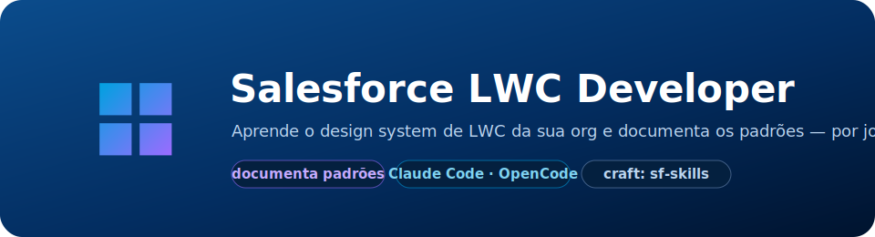

<p align="center">
  
</p>

<p align="center">
  <em>Aprende o design system de LWC da sua org e gera/edita componentes alinhados a ele &#8212; por jornada, com curadoria sua.</em>
</p>

<p align="center">
  
  
  
  
  
  
</p>

<p align="center">
  <b>📄 README</b> &nbsp;·&nbsp; <a href="./INFORMACOES.md">📖 Informações</a> &nbsp;·&nbsp; <a href="./docs/ARCHITECTURE.md">🏛️ Arquitetura</a> &nbsp;·&nbsp; <a href="./docs/PLANEJAMENTO.md">🧭 Planejamento</a> &nbsp;·&nbsp; <a href="./LICENSE">⚖️ MIT License</a>
</p>

---

Duas skills para o Claude Code (ou OpenCode) que trabalham em sequência:

- **Skill 1 — `lwc-pattern-documenter`**: **documenta** o design system de LWC da sua
  org, por jornada/produto, num Markdown vivo. Só lê e documenta.
- **Skill 2 — `lwc-pattern-generator`**: **cria, clona/adapta ou edita** LWCs alinhados
  a essa documentação, delegando o craft às skills oficiais da Salesforce.

> Para a arquitetura, as decisões de design e a estratégia por trás do projeto, veja
> **[Informações](./INFORMACOES.md)**. Este README é só o começo rápido.

---

## ⚡ Pré-requisitos e instalação

- **Node 18+** (scripts das skills não têm dependências externas).
- **Projeto SFDX** com componentes em `force-app/*/lwc/`.
- **[Claude Code](https://docs.claude.com/en/docs/claude-code)** ou **[OpenCode](https://opencode.ai)**.

### Instale — copie **apenas a pasta `.claude`** para o seu projeto

Rode **de dentro da pasta do seu projeto** (onde está `force-app`):

**Windows (PowerShell):**
```powershell
git clone --depth 1 https://github.com/brunotrolo/Salesforce-LWC-Developer.git .skill-tmp; New-Item -ItemType Directory -Force .claude | Out-Null; Copy-Item -Recurse -Force .skill-tmp\.claude\* .claude\; Remove-Item -Recurse -Force .skill-tmp
```

**Mac / Linux / Git Bash:**
```bash
git clone --depth 1 https://github.com/brunotrolo/Salesforce-LWC-Developer.git .skill-tmp && mkdir -p .claude && cp -r .skill-tmp/.claude/. .claude/ && rm -rf .skill-tmp
```

Isso instala as 2 skills próprias (`lwc-pattern-documenter` + `lwc-pattern-generator`),
as 2 skills oficiais de craft (`experience-lwc-generate` + `design-systems-slds-apply`)
e o `.claude/settings.json` (segurança da Skill 2).

> **Já usa a [`apex-test-loop`](https://github.com/brunotrolo/Salesforce-Apex-Cover-Loop)
> no mesmo projeto?** Ela também tem `settings.json` próprio — **não deixe o comando
> acima sobrescrever o seu**. Mescle os dois (`deny` + os hooks `PreToolUse` de cada
> guard) em vez de substituir o arquivo. Detalhes em [Informações](./INFORMACOES.md).

**Para atualizar:** rode o mesmo comando de novo.

Abra o Claude Code na pasta do projeto:
```bash
claude
```
As skills carregam automaticamente a partir de `.claude/skills/`.

---

## 📗 Skill 1 — `lwc-pattern-documenter`: como usar

Dispare com `/lwc-pattern-documenter` ou em linguagem natural:
> "documente os padrões de LWC da jornada Faturas"
> "aprenda o design system desses componentes de Atendimento"

A skill conduz um roteiro de perguntas — nunca "recebe e sai processando":

1. Pergunta a **jornada/produto** (ex.: "Faturas", "Atendimento ao Cliente").
2. Pergunta **quais LWCs** representam essa jornada — você aponta os caminhos, ou pede
   para a skill listar os componentes do projeto (mínimo de 3, para não confundir
   coincidência com convenção).
3. Extrai os sinais (naming, CSS/SLDS, slots, eventos, contrato `@api`, `@wire`/Apex,
   acessibilidade...) e mostra um **preview** do que vai gravar.
4. Só grava após seu "ok" — na seção `## Padrão: <Jornada>` de
   `.lwc-pattern-documenter/lwc-design-system/design-patterns.md`.

Divergências entre componentes ficam **documentadas, nunca decididas** pela skill —
a escolha é sempre sua.

## 📘 Skill 2 — `lwc-pattern-generator`: como usar

Dispare pedindo para **criar**, **clonar** ou **editar** um LWC, sempre citando (ou
deixando a skill perguntar) qual jornada usar como referência:
> "crie um novo componente para listar cotas, seguindo o padrão da jornada Consórcio"
> "clone o componente `consorcioBlocoResumo` e adapte para mostrar dados de seguro"
> "edite o `alertInfo` para adicionar um novo tipo de alerta"

A skill escolhe o modo certo com você (nunca assume) e segue o guia:

1. Confirma a **jornada de referência** já documentada pela Skill 1 (nunca gera sem
   uma) — no modo Editar, descobre a jornada sozinha a partir do componente apontado.
2. Coleta o requisito (varia por modo) e confere se o nome do componente já existe.
3. **Criar/Clonar**: mostra o que vai reaproveitar do padrão vs. o que é específico do
   cenário. **Editar**: mostra o **diff** proposto. Aprovação obrigatória nos dois casos.
4. Gera/edita delegando o craft para `experience-lwc-generate` (bundle, `@wire`,
   Apex/GraphQL, a11y, Jest) e `design-systems-slds-apply` (SLDS).
5. Mostra a **pontuação de aderência** ao padrão da jornada junto com o resultado do
   craft delegado, antes do deploy (também com aprovação explícita).

---

<p align="center">
  ⭐ <b><a href="https://github.com/brunotrolo/Salesforce-LWC-Developer/stargazers">Dê uma star no repo</a></b> para acompanhar novas melhorias.
</p>

<p align="center">
  <sub>
    Craft de LWC vindo das <b><a href="https://github.com/forcedotcom/sf-skills">skills oficiais da Salesforce</a></b> (<code>forcedotcom/sf-skills</code>, Apache-2.0) &nbsp;·&nbsp;
    <a href="https://docs.claude.com/en/docs/claude-code">Claude Code</a>
  </sub>
</p>

<p align="center">
  <sub>Orquestração e aprendizado de padrões © <a href="https://github.com/brunotrolo">brunotrolo</a> · <a href="./LICENSE">MIT</a>. Skills <code>experience-lwc-generate</code> e <code>design-systems-slds-apply</code> redistribuídas sob Apache-2.0 (ver <code>.claude/skills/VENDOR-ATTRIBUTION.md</code>).</sub>
</p>
